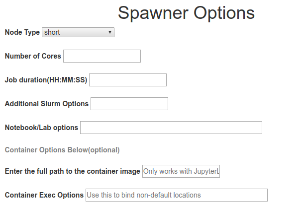

#### Table of Contents
* [Introduction](#introduction)
* [Launching Jupyter](#launching-jupyter)
* [Environments and Software](#environments-and-software)
* [Best Practices](#best-practices)

---
# Introduction
## Background
[Project Jupyter](https://jupyter.org/index.html) is a open source software stack that supports interactive data science and scientific computing across a wide array of programming languages ([>130 supported kernels](https://github.com/jupyter/jupyter/wiki/Jupyter-kernels)). The primary applications within Jupyter are:

  1. [JupyterHub](https://jupyterhub.readthedocs.io/en/stable/#): Jupyter's multi-user server. This application spawns, manages, and proxies multiple instances of the single-user JupyterLab server.
  
  2. [JupyterLab](https://jupyterlab.readthedocs.io/en/stable/): Jupyter’s next-generation notebook interface, which includes:
    

<!--  -->

   <br>[Notebooks](https://jupyterlab.readthedocs.io/en/stable/user/notebook.html)<br>
   [Text Editor](https://jupyterlab.readthedocs.io/en/stable/user/file_editor.html) <br>
   [Terminal](https://jupyterlab.readthedocs.io/en/stable/user/terminal.html)<br>
   [File Browser](https://jupyterlab.readthedocs.io/en/stable/user/files.html)<br> 
   [Data Viewer](https://jupyterlab.readthedocs.io/en/stable/user/file_formats.html)<br>
   [Markdown](https://jupyterlab.readthedocs.io/en/stable/user/file_formats.html#markdown)<br> 
   Context Help<br>
   [Extensions](https://jupyterlab.readthedocs.io/en/stable/user/extensions.html)<br><br><br>

  ## Why Jupyter

  The Jupyter software stack is popular amoung data scientiests and researches ([Perkel, 2018](https://www.nature.com/articles/d41586-018-07196-1)) because:
  * Interactive data exploration features
  * Browser based IDE (easy to work on remote systems such as HPC and Cloud)
  * Language agnostics (supports >130 kernels)
  * Easy to convert analyses and results into sharable formats ([nbconvert](https://nbconvert.readthedocs.io/en/latest/)) such as slides, html, pdf, latex, etc...
  * Easy to share, collaborate, and archive analyses and results
  * Broad software stack that inter-operates with other Open Source projects
    * [My Binder]()
    * [repo2docker](https://github.com/jupyter/repo2docker)
    * GitHub (renders notebooks)
    * Access and authentication to arbitrary external processes (such as RStudio Server, Shiny Server, PostgreSQL, etc) via [jupyter-server-proxy](https://jupyter-server-proxy.readthedocs.io/en/latest/).
  * Customizable and Extensible
  * Open Source
 
---
# Launching Jupyter
There are multiple approaches for accessing the Jupyter stack on Ceres. 

* Port Foward with Putty - [Video Coming Soon]()
* Port Foward with Secure Shell (SSH) - [Video Coming Soon]()
* JupyterHub (see below)

The easist and most succinct method to launch JupyterLab is the JupyterHub interface. To access, you must have a functioning SCINet account. To setup an account, see the [quickstart guide](https://usda-ars-gbru.github.io/scinet-site/guide/quickstart). Below are the instructions, followed by a video of the process.

1. **Go To:** COMING SOON
2. **Log into JupyterHub** (SCINet credentials)
   * Username: SCINet username
   * Verification Code: 6 digit time-sensitive code
   * Password: SCINet password
3. **Spawning a JupyterLab Instance**
  
   The Spawning page includes a comprehensive set of options for customizing JupyterLab.<br><br>

<!-- update image after Yash finishes edits, copy image to SCINet site-->
<!--  -->

   * <u><i> Node Type</i></u>: Which partition ([Ceres partitions](https://usda-ars-gbru.github.io/scinet-site/guide/ceres/#partitions-or-queues)) to spawn JupyterLab
   * <u><i> Number of Cores</i></u>: How many cores to allocate (must be an even number)
   * <u><i> Job Duration</i></u>: How long should the Slurm (Ceres resource allocation manager) allocate to this task
   * <u><i> Additional Slurm Options</i></u>: Additional options for Slurm (see [sbatch options](https://slurm.schedmd.com/sbatch.html)). An example may be *--mem-per-cpu=6GB*
   * <u><i> Working Directory</i></u>: The directory to launch JupyterLab. An example may be */project/name_of_project*
   * <u><i> Container Path</i></u>: Singularity container to use to launch JupyterLab. If blank, will use the defualt container (see Jupyter Environments below).
   * <u><i>Container Options</i></u>: [Additional options] for executing the container (see the [singularity exec options](http://singularity.lbl.gov/archive/docs/v2-3/docs-exec). An example may be *--bind /project/name_of_project*<br>

4. **Terminating JupyterLab**
  
   To end the JupyterLab instance go to: *File* **-->** *Hub Control Panel* **-->** *Stop Server*

Below is a video (COMING SOON) showing the above process.

<div style="text-align:center;">
<video controls width="500" title="JupyterHub + Ceres">
    <source src=".....mp4"
            type="video/mp4">
</video>
</div>

---
# Environments and Software

## Default Environment
The default environment includes:
  * Python and the IPython kernel.
  * JupyterLab (and/or Jupyter Notebook)
  * Ability to load Ceres maintained software (see below)
  * Slurm Que Manager

## Bring Your Own Environment
  If you have an environment (e.g. a conda environment) in your $HOME directory (e.g. ~/.conda/envs/my_env) with a Jupyter Kernel installed, JupyterLab will autoload this environmnet as a seperate kernel. For instance, a conda environment named <i>my_env</i> with the IPyKernel will appear as <i>Python [conda env:myenv]</i> in the list of optional kernels in JupyterLab.

## Use Ceres Maintained Software
  The default environment includes an extension (located on the left vertical section of JupyterLab) to load Ceres software into the current environment. This is the software visible with the `module avail` command.

## Containerized Environment
JupyterHub will spawn an instance of JupyterLab using a singularity container. Whichever container selected needs to have JupyterLab installed. Users can specify a container in the <i>Container Path</i> section on the Spawner Options page. There are several ways to access containers on Ceres:
   * Pointing to a prebuilt container either maintained by the yourself or by the VRSC (located at `/references/containers/`).
   * Pointing to a prebuilt container on an external hub, such as [Docker Hub](https://hub.docker.com/) or [Singularity Hub](https://singularity-hub.org/). **When launching JupyterLab from a container located on a <i>Hub</i> for the first time, it will take 1-10 minutes** to start JupyterLab because the container needs to be downloaded, built, and cached. However, on subsequent tries it should be quite fast ~10-20 seconds (the image is now cached in your $HOME directory). If the container is modified on the <i>Hub</i>, it will be re-downloaded, built, and cached.
     1. An example input into *Container Path*: ```docker://jupyter/datascience-notebook```
     2. Project Jupyter maintains a set of containers ([Jupyter Stacks](https://jupyter-docker-stacks.readthedocs.io/en/latest/using/selecting.html#image-relationships)) which include:
        * [Scipy-Notebook](https://hub.docker.com/r/jupyter/scipy-notebook/)
        * [R-Notebook](https://hub.docker.com/r/jupyter/r-notebook/)
        * [Tensorflow-Notebook](https://hub.docker.com/r/jupyter/tensorflow-notebook/)
        * [DataScience-Notebook](https://hub.docker.com/r/jupyter/datascience-notebook/)
        * [PySpark-Notebook](https://hub.docker.com/r/jupyter/pyspark-notebook/)
        * [All-Spark-Notebook](https://hub.docker.com/r/jupyter/all-spark-notebook/)
---
# Best Practices
## Resource Conservation
  * For short sessions (2hrs or less) please choose the brief-low partition in the "Node Type" drop down, if available.
  * For serial computing (non-parallel code) enter 2 or 4 for "*Number of Cores*" in the spawner options. If a computation is not parallelized, having more cores will not improve the computation power.
  * For parallel computing choose a reasonable number of cores to meet your needs.
  * Choose a reasonable job duration.
  * Remember to stop the jupyter server when you are done working (`File --> Hub Control Panel --> Stop Server`).
  
## Reproducible Research
  * <b>Version Control</b>: The gold standard are version control systems like [Github](https://github.com/) or [Gitlab](https://about.gitlab.com/).
  * <b>Legible and Interperable Code</b>: Coding documents should includeinformation about the mechanics of the code (commenting within code blocks) as well as the underlying scientific narrative (adding markdown cells surronding anlaysis and results).
  * <b>Archiving Computational Environment</b>: Containerized environments, such as [Docker](https://www.docker.com/) and [Singularity](https://sylabs.io/docs/), provide the best approach for archiving computatoinal environments. Services such as Docker Hub and Singularity Hub can store images associated with specific research or publications. Another approach is to capture computational environments as text output, such as a [conda requirements.txt](https://docs.conda.io/projects/conda/en/latest/user-guide/tasks/manage-environments.html#creating-an-environment-from-an-environment-yml-file) file.
  * <b>Data Providence/Archiving</b>: If utilizing a public dataset, the source and version should be documented. If using non-public data, the data should be published to a public repository, such as [NAL](https://www.nal.usda.gov/main/) or [AgCross](https://agcros-usdaars.opendata.arcgis.com/pages/general-information/).

  A detailed tutorial about conducting reproducible research can be found at: LINK_COMING_SOON

## Tutorials and Packages for Parallel Computing
Developing scripts that utilize resources of a cluster can be challenging. Below are some software packages that may assist in parallelizing computations as well as links to some Ceres specific examples.
  
  * Python
    1. Package: [Dask](https://dask.org/)<br>
    Ceres Tutorial: [Coming Soon]()
    2. Package: [Ipyparallel](https://ipyparallel.readthedocs.io/en/latest/)<br>
    External Tutorial: [Coming Soon]()
    3. [Ray](https://ray.readthedocs.io/en/latest/)<br>
    External Tutorial: [Coming Soon]()
    4. [Joblib](https://joblib.readthedocs.io/en/latest/)<br>
    External Tutorial: [Coming Soon]()
  * R
    1. [rslurm](http://cyberhelp.sesync.org/rslurm/)<br>
      Ceres Example: [Coming_Soon](None)
    2. [Parallel](https://www.rdocumentation.org/packages/parallel/versions/3.6.2)<br>
    External Tutorial: [Coming Soon]()
    3. [doParallel](https://cran.r-project.org/web/packages/doParallel/doParallel.pdf)<br>
    External Tutorial: [Coming Soon]()
    4. [Snow](https://cran.r-project.org/web/packages/snow/snow.pdf)<br>
    External Tutorial: [Coming Soon]()
